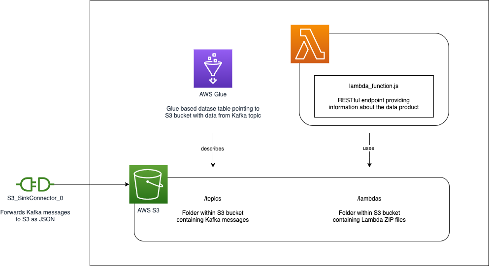

# Data Mesh Terraform module "Confluent Kafka to AWS S3"

This Terraform module provisions the necessary services to provide a data product on AWS.



## Services

* Confluent Kafka
* AWS S3
* AWS Athena
* AWS Glue
* AWS Lambda

## Usage

```
module "kafka_to_s3 {
  module = "git@github.com:datamesh-architecture/terraform-datamesh-dataproduct-confluent-kafka-to-aws-s3.git"

  domain = "<data_product_domain>"
  name   = "<data_product_name>"
  input  = [
    {
      topic      = "<topic_name>"
      format     = "<format>"
      table_name = "<table_name>"
      schema     = "schema/<name_of_the_schema>.schema.json"
    }
  ]
  output = {
    grant_access = [ "<aws_account_id>" ]
  }
}
```

## Examples

Examples, how to use this module, can be found in a separate [GitHub repository](https://github.com/datamesh-architecture/terraform-datamesh-dataproduct-examples).

## Requirements

| Name                                                                      | Version    |
|---------------------------------------------------------------------------|------------|
| <a name="requirement_terraform"></a> [terraform](#requirement\_terraform) | >= 1.3.7   |
| <a name="requirement_aws"></a> [aws](#requirement\_aws)                   | >= 4.0     |
| <a name="requirement_confluent"></a> [confluent](#requirement\_confluent) | >= 1.24.0  |

## Providers

| Name                                                                | Version   |
|---------------------------------------------------------------------|-----------|
| <a name="provider_aws"></a> [aws](#provider\_aws)                   | >= 4.0    |
| <a name="provider_confluent"></a> [confluent](#provider\_confluent) | >= 1.24.0 |

## Authors

Module is maintained by []().

## License

MIT License Licensed. See [LICENSE](https://github.com/datamesh-architecture/terraform-datamesh-dataproduct-confluent-kafka-to-aws-s3/blob/main/LICENSE) for full details.
